# O que é o *Redox*

O *[Redox](https://github.com/mattdibi/redox-keyboard/tree/master/redox)* é um teclado ergonômico *split* e ortolinear escalonado. Tais características são
aprimoramentos em relação ao formato tradicional de teclados, onde a posição das teclas não
corresponde ao movimento natural dos dedos.

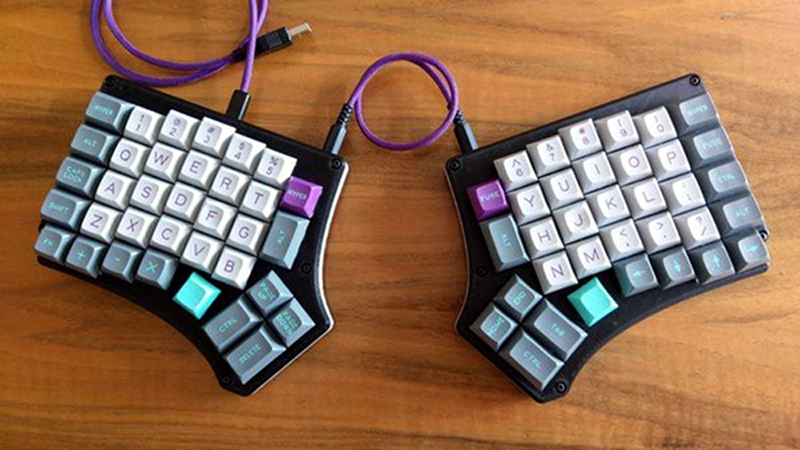

# Lista de materiais

<table border="2" cellspacing="0" cellpadding="6" rules="groups" frame="hsides">

<colgroup>
<col  class="org-left" />

<col  class="org-right" />
</colgroup>
<thead>
<tr>
<th scope="col" class="org-left">Item</th>
<th scope="col" class="org-right">Quantidade</th>
</tr>
</thead>

<tbody>
<tr>
<td class="org-left">*Switch* mecânico compatível com *Cherry MX*</td>
<td class="org-right">70</td>
</tr>

<tr>
<td class="org-left">Placa de circuito *Redox*</td>
<td class="org-right">2</td>
</tr>

<tr>
<td class="org-left">Diodo 1N4148</td>
<td class="org-right">70</td>
</tr>

<tr>
<td class="org-left">Conector cabo P2 fêmea PJ-320A (3.5mm)</td>
<td class="org-right">2</td>
</tr>

<tr>
<td class="org-left">Resistor 4.7k</td>
<td class="org-right">2</td>
</tr>

<tr>
<td class="org-left">Chave Táctil (Push Button) 6x6x6mm</td>
<td class="org-right">2</td>
</tr>

<tr>
<td class="org-left">Microcontrolador Arduino Pro Micro</td>
<td class="org-right">2</td>
</tr>

<tr>
<td class="org-left">Cabo P2 (macho-macho)</td>
<td class="org-right">1</td>
</tr>

<tr>
<td class="org-left">Cabo USB - USB micro (cabo de carregador de celular, **sem ser USB tipo C**)</td>
<td class="org-right">1</td>
</tr>

<tr>
<td class="org-left">Keycap compatível com *Cherry MX*</td>
<td class="org-right">70 (10 x 1.25u, 6 x 1.5u, 54 x 1u)</td>
</tr>

<tr>
<td class="org-left">Caixa impressa em 3D (4 peças, 2 pra cada lado)</td>
<td class="org-right">1</td>
</tr>

<tr>
<td class="org-left">Parafuso M3x8mm ou M3x5mm</td>
<td class="org-right">10</td>
</tr>
</tbody>
</table>

Todas as peças, exceto a caixa:

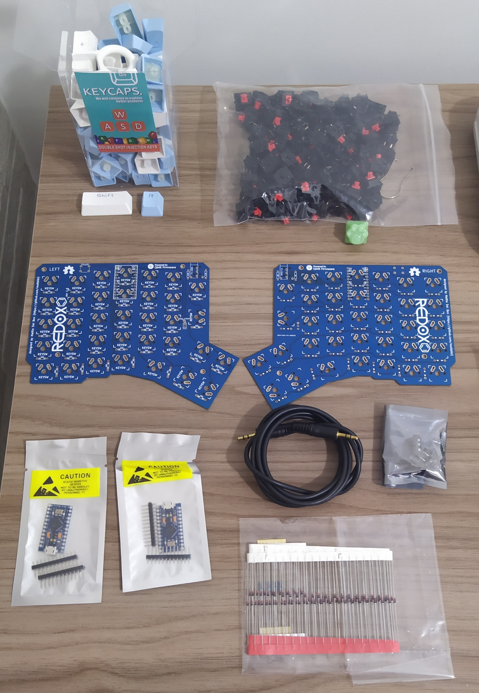

## *Switches*

Existem vários modelos de *switch* compatíveis com o padrão *Cherry MX*, inclusive de
diversos fabricantes. Cada modelo apresenta características táteis e sonoras únicas, e
você deve se informar sobre as diferenças para escolher o mais adequado ao seu
uso. Note que alguns modelos são muito barulhentos, duros ou macios, lineares ou não,
então essa escolha pode influenciar muito no seu produto final. Apesar de qualquer um
no formato *Cherry MX* ser compatível com o teclado, trocar os *switches* depois do teclado
montado é complicado, pois eles fazem parte da composição estrutural junto da caixa.

Você pode explorar as características de alguns destes modelos no [site da *Cherry*](https://www.cherrymx.de/en/mx-original/mx-red.html), mas
outras fabricantes são igualmente válidas.

## Diodos, resistores, botões e cabos

Como estes componentes são largamente disponíveis e padronizados, você pode comprar
facilmente em lojas locais de eletrônica, por um bom preço. Certifique-se de que os
modelos são exatamente os especificados, e não haverá problemas.

## Arduino Pro Micro

O Arduino Pro Micro possui uma versão paralela, que apresenta algumas pequenas
diferenças, mas **não é compatível com o projeto**. Certifique-se que os arduinos que você
está comprando possuem o jumper J1, que é suficiente para diferenciar as duas versöes.

## Keycaps

Existem centenas de fornecedores de keycaps compatíveis com *Cherry MX*, e suas
características são das mais variadas possíveis. Além do fator estético, tenha em mente
que existem [diversos formatos de keycaps](https://deskthority.net/wiki/Keyboard_profile), e que o *Redox* é um teclado plano e
aprumado. Há diversas possibilidades de inclinar seu *Redox* com peças extras, seja
lateral ou frontalmente, e isso pode influenciar no melhor formato de keycaps para
você.

## Placa de circuito e Caixa

O repositório do *Redox* já fornece o projeto completo destas peças, restando a você
simplesmente enviar os arquivos aos fabricantes. Para as placas de circuito, você
precisa de um fabricante industrial, pois a produção destas peças não é trivial. Apesar
disso, há uma boa abundância de fornecedores no mercado. Já a caixa necessita apenas de
uma impressora 3D para sua produção, possibilitando que até mesmo hobbistas da
impressão 3D sejam capazes de produzir as peças.

De qualquer forma, a sua participação não requer conhecimento ou expertise na
fabricação, e portanto provavelmente não terá nenhuma complicação.

## Onde comprar as peças?

Recomendo que compre os *switches*, as keycaps e os Arduinos no AliExpress, devido ao preço
consideravelmente mais baixo. Confira se os fornecedores dos quais você irá comprar são
bem avaliados, e se as peças são realmente originais. Eu comprei todos meus componentes
lá, e não tive nenhum problema. Todos chegaram em pouco menos de um mês, em perfeito
estado.

As placas de circuito e as caixas devem ser produzidas sob medida. Alguns membros do
grupo possuem bons contatos para a produção destas peças.

## Materiais para montagem

A montagem requer um ferro de solda e solda para eletrônica, algum material isolante
(fita isolante, folha plástica, etc.) e um alicate. Estas ferramentas custam menos de
100 reais no total, e você gastará uma quantidade insignificante de solda. Se você
pretende desenvolver outros projetos de eletrônica no futuro, este investimento vale
mais do que a pena. Caso contrário, quem sabe alguém do grupo pode te emprestar :)

# Montagem

1.  Solde todos os diodos, chaves táteis e conectores p2, o mais rente possível à
    placa. Corte o excesso das pernas.
2.  Solde os resistores **em apenas uma das placas**.
3.  Solde os conectores para os Arduinos, **mas não solde os Arduinos ainda**. Caso seus
    Arduinos tenham vindo com *header pins*, você pode utilizá-los. Se não, pode usar o
    excesso das pernas dos diodos. Caso use os *header pins*, garanta que serão soldados
    rentes à placa, pois o espaço é limitado.
    
    Neste ponto, sua placa deve estar assim:
    
    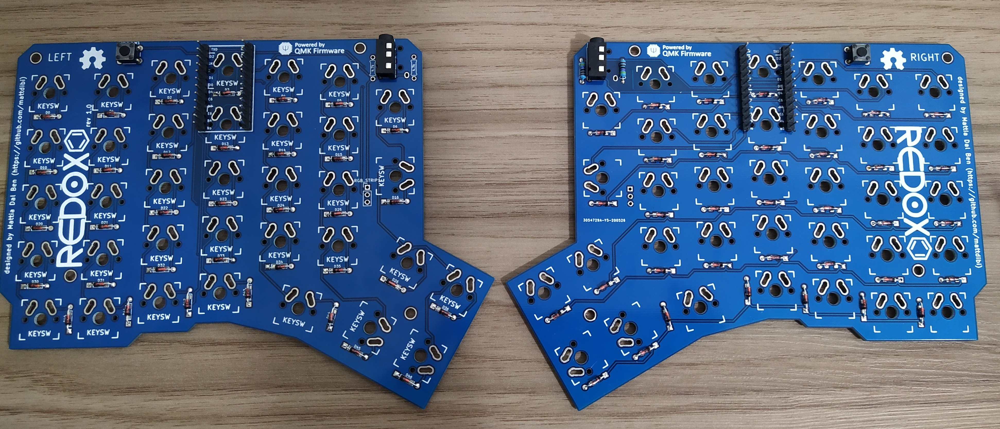
    
    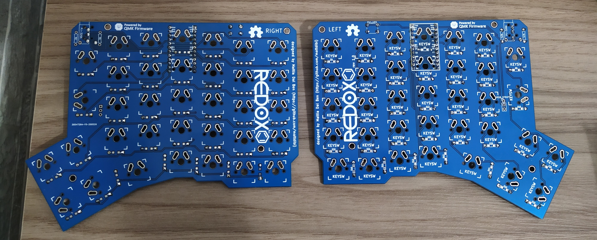
4.  Encaixe os *switches* nas tampas das caixas. Note que estes devem ser encaixados na
    orientação correta, para casar com a placa de circuito. Caso haja excesso de rebarbas
    na impressão 3D, remova-os com uma lixa de unha.
    
    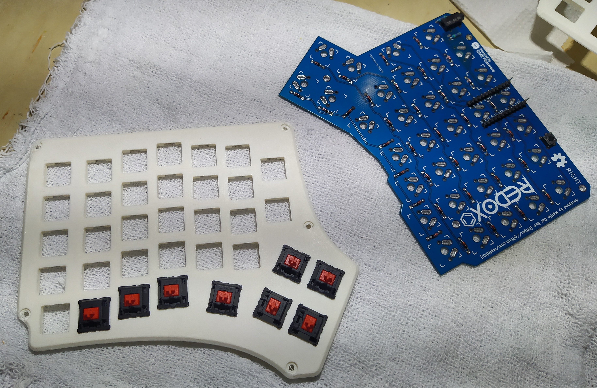
    
    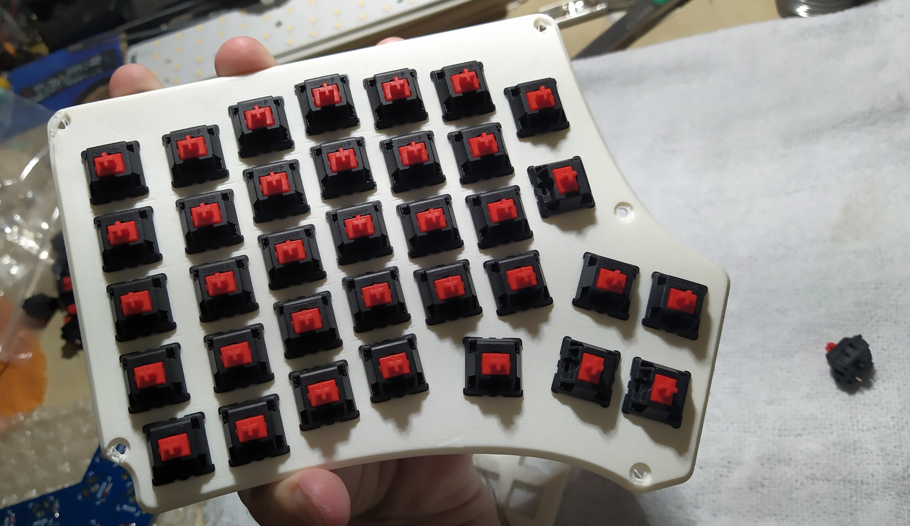
5.  Encaixe a placa de circuito na tampa junto dos *switches*, e garanta que ela está
    encaixada firmemente e sem folga. Então, solde todos os *switches* na placa.
    
    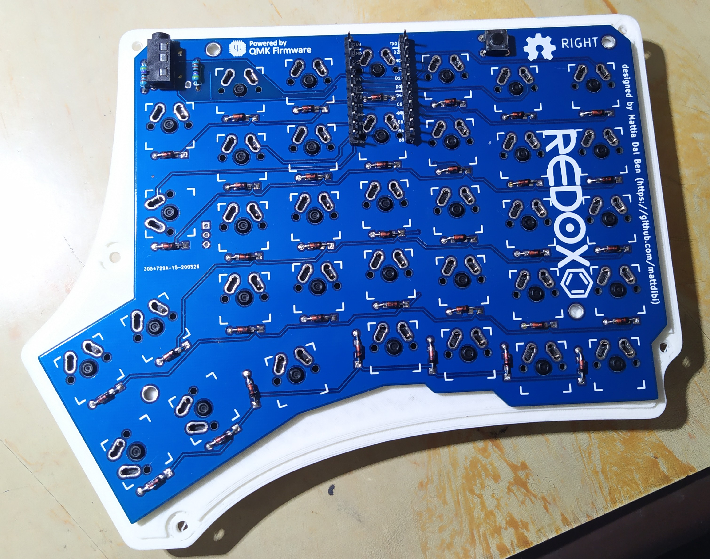
6.  Coloque o isolante elétrico entre as pernas dos Arduinos, para garantir que não
    haverá curtos com os diodos.
    
    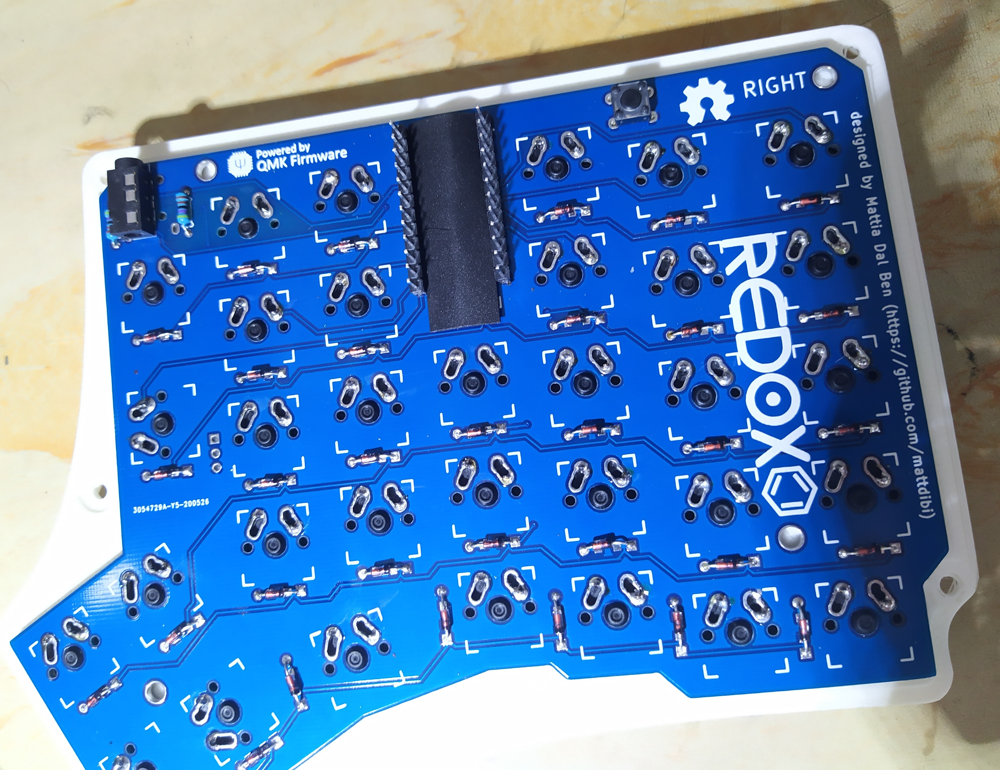
7.  Solde os Arduinos. Na placa onde lê-se *Left*, **solde-o com os componentes para cima**. Na
    placa onde lê-se *Right*, **solde-o com os componentes para baixo**.
    
    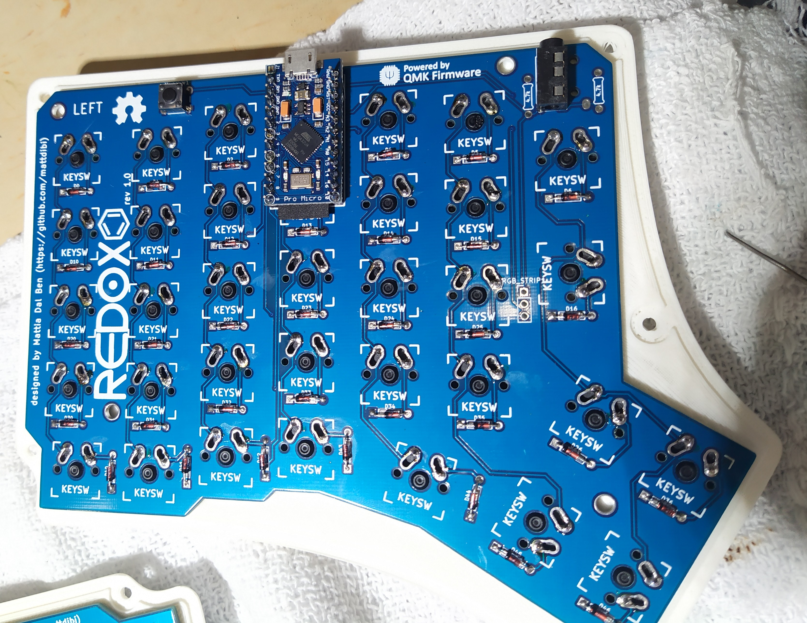
    
    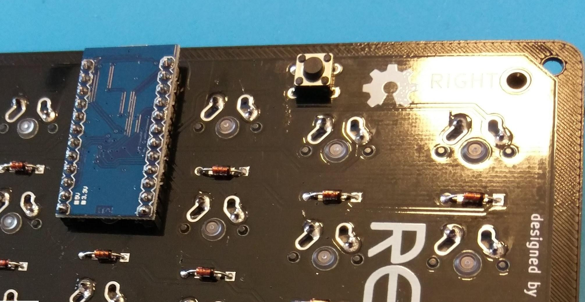
8.  Feche a caixa utilizando os parafusos.
9.  Encaixe as keycaps nos *switches*, e ligue os cabos.
10. Agora só falta instalar o *firmware*, e seu *Redox* estará pronto!

# *Firmware*

O *Redox* utiliza o *firmware* de código aberto *QMK*. Para fazer o download e o *setup* local,
 siga os passos de 1 a 4 do [guia oficial](https://docs.qmk.fm/#/getting_started_build_tools).

## Instalação

A instalação deve ser realizada em **ambas metades do teclado**.

Conecte seu teclado e execute o seguinte comando **como root na pasta do *QMK***:

    # make redox/rev1:default:avrdude

Após a compilação do *firmware*, a seguinde mensagem será exibida:

    Detecting USB port, reset your controller now.....

Isso significa que você deve pressionar o botão interno do reclado para resetar o
Arduino. Assim que pressionado, o processo de instalação prosseguirá, e basta aguardar.

## Layout

Para customizar seu *layout*, visite o arquivo
`qmk_firmware/keyboards/redox/keymaps/default/keymap.c`, e ajuste-o conforme sua
preferência. A descrição dos keycodes pode ser consultada na [documentação oficial](https://beta.docs.qmk.fm/using-qmk/simple-keycodes/keycodes_basic). Após
salvar, basta repetir o processo de instalação.

# Resultado final

Depois de montar tudo, meu *Redox* ficou assim:

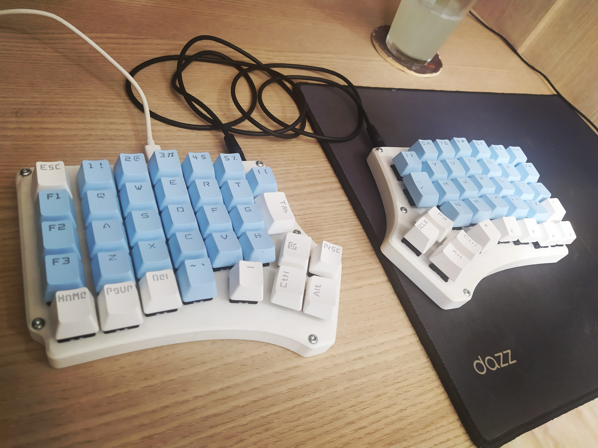

Até o Panda, meu gato favorito, gostou do resultado final:

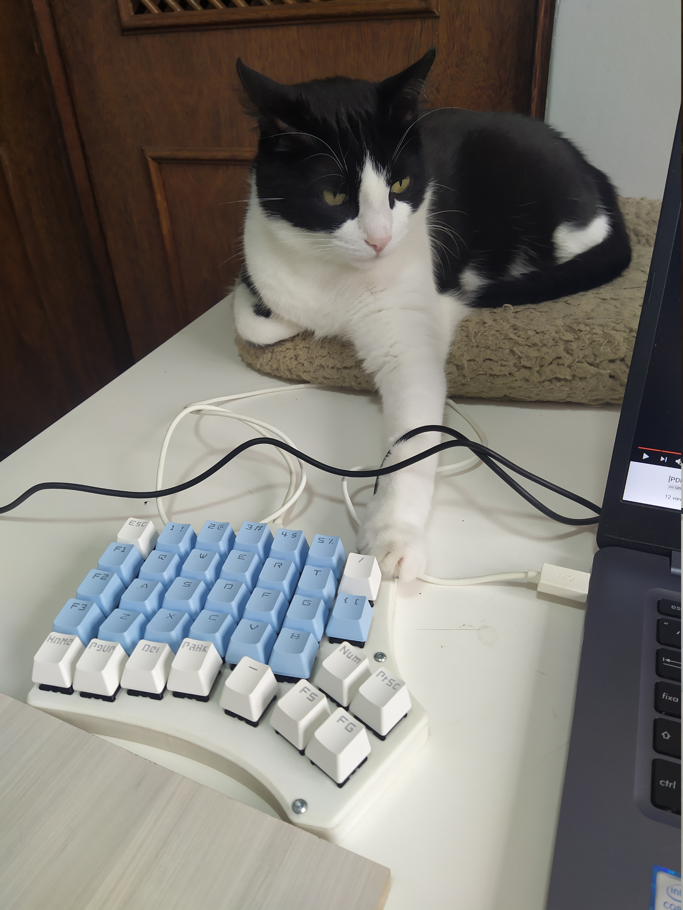

# Adereços

Não acaba por aí. Você pode construir adereços para obter conforto máximo. No meu caso,
utilizei pranchas de EVA para fazer um descanso de pulso que encaixa perfeitamente no
teclado. Seja criativa!

# Conclusão

Espero que este guia sirva de ajuda para você. Lembre-se sempre de consultar o
[repositório original](https://github.com/mattdibi/redox-keyboard/tree/master/redox), e caso ainda tenha alguma dúvida, pergunta pra gente lá no grupo!

